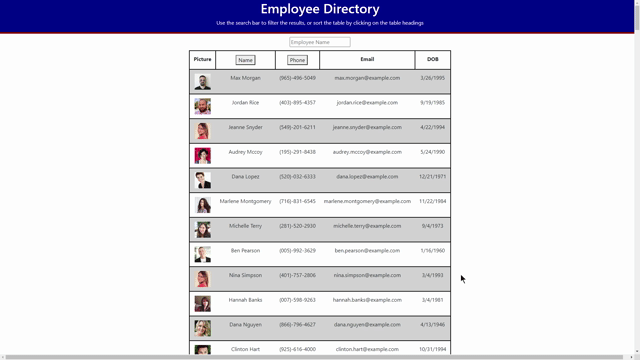

# Employee Directory

   [](#License)

   ## Description
   This app takes a random assortment of users from the Random User API and provides you with some information that you might see in a list of employees in a directory. You will be able to sort the list of users alphabetically as well as by phone number in either Ascending or Descending order. You will also be able to filter the list to search for a specific user by name or phone number. 

   ## Table of Contents
   * [Installation](#Installation)
   * [Usage](#Usage)
   * [License](#License)
   * [Tests](#Tests)
   * [Questions](#Questions)
   
   ## Installation
   To install, use the following commands in the terminal:

   ```
   npm install
   ```

   ## Usage
   Once you have finished the instructions in the Installation section, you can use the following command to start the server:

   ```
   npm start
   ```

   ## License
   The license associated with this project is MIT.
   To view the license information, visit the link [here](https://github.com/CalebParris/employee-directory/blob/master/LICENSE)

   ## Tests
   After following the directions in the installation and Usage sections, you can test the application as shown in the gif below

   

   Here is a link to the deployed version of this app:

   [https://calebparris.github.io/employee-directory/](https://calebparris.github.io/employee-directory/)

   If you would like to deploy a version of this for yourself, change the url of the "homepage" key in the package.json file to the link of your choosing.

   ## Questions
   If you have any comments, questions, or concerns about this project, please post them [here](https://github.com/CalebParris/employee-directory/issues) and I will respond as soon as I am able.

   Otherwise, you can contact me through the following means:
   * Email: calebparris@live.com
   * Github: [CalebParris](https://github.com/CalebParris)
    
